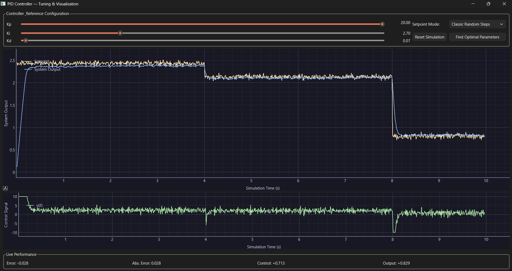

This is a PID controller tuning tool. The goal is to make something that making designing controllers a little easy.

---

Plan:

Add a system identification pipeline, for learning the system dynamics.

Thus, the flow becomes, 

Controller (tuned with gradient descent) ---> System (learnt from SI)

Further, i want to improve the gradient descent algorithm, it is way too trivial.
1. Attempt to find a global minima
2. Run for a longer time
3. Etc